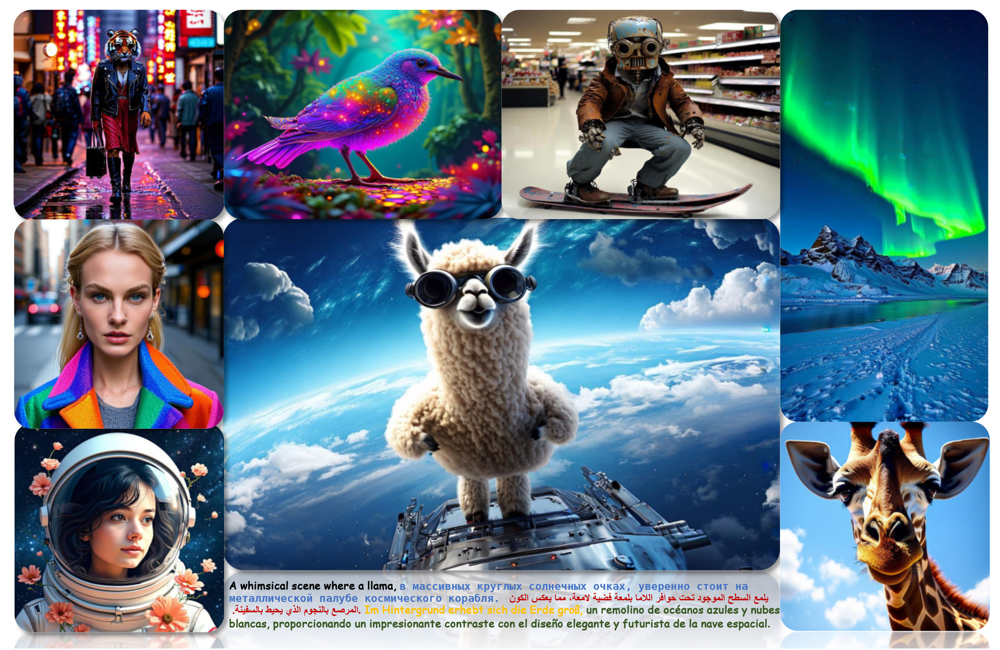

# LDGen: Enhancing Text-to-Image Synthesis via Large Language Model-Driven Language Representation

[](https://arxiv.org/abs/)
[](https://zrealli.github.io/LDGen)


This repository contains the official implementation of the following paper:
> **LDGen: Enhancing Text-to-Image Synthesis via Large Language Model-Driven Language Representation** <br>

<div>
    <h4 align="center">
        
    </h4>
</div>


## :open_book: Coming soon
LDGen integrates large language models (LLMs) into existing text-to-image models, supporting zero-shot multilingual text-to-image generation.

## 📖 Citation BibTeX
Please consider citing our paper if our code is useful:
```bib
@article{li2025ldgen,
  title={LDGen: Enhancing Text-to-Image Synthesis via Large Language Model-Driven Language Representation},
  author={Li, Pengzhi and Yu, Pengfei and Liu, Zide and He, Wei and Pan, Xuhao and Rao, Xudong and Wei, Tao and Chen, Wei},
  journal={arXiv preprint arXiv:2502.18302},
  year={2025}
}
```
